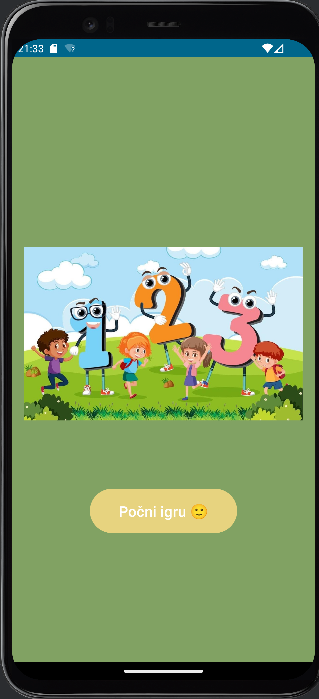
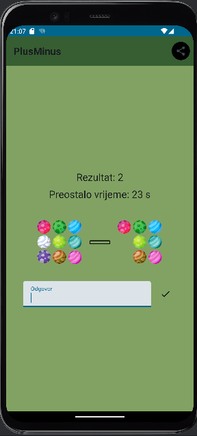
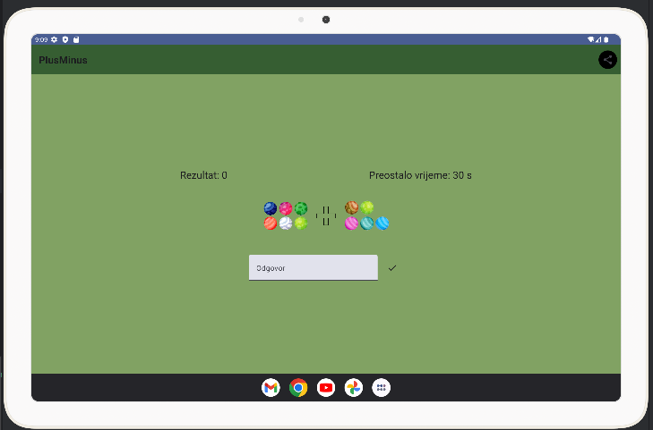
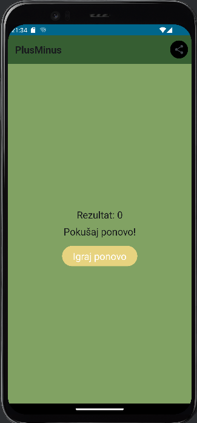

# Opis rada aplikacije i izgled aplikacije

Kada korisnik otvori aplikaciju, započinje sa početnim ekranom. Na ovom ekranu se nalazi slika i dugme za početak igre. Nakon što korisnik pritisne dugme za početak igre, prelazi na ekran za igru. Ovdje mu se prikazuje matematički zadatak koji treba riješiti. Cilj je unijeti tačan odgovor prije isteka vremena. Aplikacija prati broj tačnih odgovora i prikazuje ukupni rezultat. Tokom korištenja igrice na vrhu se nalazi top bar koji sadrži ime igrice i share dugme kojim se može podijeliti rezultat stečen u igrici.

Za prilagođavanje ekrana orijentaciji, koristi se LocalConfiguration objekat kako bi se odredila trenutna orijentacija ekrana. Na osnovu ove informacije, određuje se raspored elemenata unutar layout-a. Na primjer, u vertikalnoj orijentaciji, elementi se raspoređuju jedan ispod drugog dok se u horizontalnoj orijentaciji koristi Row layout za prikaz elemenata jedan pored drugog. Kroz korištenje ovog pristupa, omogućeno je da se izgled ekrana prilagodi orijentaciji uređaja. U ovoj aplikaciji nema mnogo razlika u orijentaciji osim u mjestu prikazivanja rezultata i vremena. Razlog tome je mali broj komponenti.

Ova aplikacij također ima omogućenu višejezičnost. Višejezičnost je postignuta korišenjem dva string XML file-a. Prvi file sadrži sve stringove na bosanskom, a drugi file je napravljen sa qualifier-om country code. Kako je za kod stavljen kod Ujedinjenog Kraljevstva, to svi korisnici koji imaju engleski kao jezik na svom uređaju će vidjeti sadržaj na engleskom jeziku. Taj drugi XML file sadrži sve stringove koji imaju isti naziv kao originalni strings file.

### Početni ekran (LandingScreen)

Početni ekran (LandingScreen) aplikacije prikazuje sliku i dugme za početak igre. Ovo je prva stvar koju korisnik vidi kada otvori aplikaciju. Dizajn je jednostavan i prilagođen djeci, sa velikim dugmetom koje je lako uočiti i pritisnuti.

### Ekran za igru (MathApp)

Nakon pritiska na dugme za početak igre, korisnik prelazi na ekran za igru (MathApp). Na ovom ekranu se korisniku prikazuje matematički zadatak koji treba riješiti. Zadatak se sastoji od dva broja i aritmetičke operacije (sabiranje ili oduzimanje). Korisnik ima određeno vrijeme (30 sekundi) da unese tačan odgovor.

Na vrhu ekrana se prikazuje trenutni rezultat (broj tačnih odgovora) i preostalo vrijeme. Korisnik unosi odgovor putem tekstualnog polja, a nakon unosa pritisne dugme za provjeru odgovora. Ako je odgovor tačan, korisnik dobija poen i generiše se novi zadatak. Ako je odgovor netačan ili vrijeme istekne, igra se završava i korisnik može pokrenuti novu igru.

## Rezultat

Kada se igra završi, prikazuje se ukupan rezultat. Korisnik može podijeliti svoj rezultat putem različitih aplikacija koristeći dugme za dijeljenje. Također, postoji mogućnost ponovnog pokretanja igre.

# Opis arhitekture aplikacije

Aplikacija koristi composable arhitekturu gdje se korisnički interfejs gradi pomoću composable funkcija. Glavni dijelovi aplikacije su:

1. Landing Screen (početni ekran): Prikazuje početnu sliku i dugme za početak igre.
2. MathApp Screen (ekran za igru): Prikazuje aritmetičke zadatke korisniku, prati rezultat i vrijeme.

Svaka od ovih funkcija je zasebna composable funkcija koja upravlja svojim stanjem i prikazom. 

## Detaljan opis funkcionalnosti pojedinačnih klasa

### MainScreen

- Ova funkcija upravlja stanjem aplikacije i određuje da li je igra počela ili ne.
- Sadrži jednostavan logički uslov (`if` statement) koji provjerava da li je igra započela i prikazuje odgovarajući ekran.
- Kada korisnik pritisne dugme za početak, stanje se mijenja i prikazuje se ekran za igru.

### LandingScreen

- Ova funkcija prikazuje početnu sliku i dugme za početak igre.
- `Image` composable funkcija koristi `painterResource` za prikazivanje slike sa resursima.
- `Button` composable funkcija koristi `onClick` lambda funkciju za promjenu stanja i početak igre.
- Slika i dugme su centrirani na ekranu koristeći `Column` sa `horizontalAlignment` i `verticalArrangement`.

# MathApp Screen (Ekran za igru)

Prikazuje aritmetičke zadatke korisniku, prati rezultat i vrijeme. Svaka od ovih funkcija je zasebna composable funkcija koja upravlja svojim stanjem i prikazom.

## Detaljan opis funkcionalnosti pojedinačnih klasa

1. MainScreen
   - Ova funkcija upravlja stanjem aplikacije i određuje da li je igra počela ili ne.
   - Sadrži jednostavan logički uslov (`if` statement) koji provjerava da li je igra započela i prikazuje odgovarajući ekran.
   - Kada korisnik pritisne dugme za početak, stanje se mijenja i prikazuje se ekran za igru.

2. LandingScreen
   - Ova funkcija prikazuje početnu sliku i dugme za početak igre.
   - `Image` composable funkcija koristi `painterResource` za prikazivanje slike sa resursima.
   - `Button` composable funkcija koristi `onClick` lambda funkciju za promjenu stanja i početak igre.
   - Slika i dugme su centrirani na ekranu koristeći `Column` sa `horizontalAlignment` i `verticalArrangement`.

3. MathApp
   - Ovo je glavna funkcija igre koja upravlja stanjem igre, uključujući rezultat, zadatak, korisnički odgovor, vrijeme i kraj igre.
   - Korištenjem `rememberSaveable` omogućeno je da se stanje sačuva čak i nakon promjene konfiguracije, poput rotacije ekrana.
   - Funkcija koristi `LaunchedEffect` za upravljanje tajmerom i provjeru odgovora.
   - Prikazuje zadatak, prati vrijeme i rezultat, te omogućava unos odgovora.
   - Korištenjem `Scaffold` funkcije kreira se osnovni layout aplikacije sa `AppBar` na vrhu.
   - Pored AppBar-a koji sadrži ime aplikacije i share dugme, glavni dio ekrana sadrži matematički zadatak prikazan slikama za bolji izgled. Također, tu se nalazi i polje za unos odgovora sa ikonom koju kada klikne, provjerava tačnost odgovora.

4. generateRandomNumbers
   - Funkcija generiše par nasumičnih brojeva između 1 i 9.
   - Korištenjem `random()` funkcije iz kotlin standardne biblioteke.

5. generateOperation
   - Funkcija nasumično bira aritmetičku operaciju, sabiranje (1) ili oduzimanje (2).

6. NumberImage
   - Funkcija prikazuje sliku koja odgovara određenom broju.
   - Slike se biraju korištenjem `when` izraza na osnovu vrijednosti broja.
   - `Image` composable funkcija koristi `painterResource` za prikazivanje odgovarajuće slike.

7. OperationImage
   - Funkcija prikazuje sliku koja odgovara aritmetičkoj operaciji.
   - Koristi `if` izraz za odabir odgovarajuće slike za sabiranje ili oduzimanje.

8. ScoreDisplay
   - Funkcija prikazuje trenutni rezultat.
   - Koristi `Text` composable funkciju za prikazivanje rezultata sa odgovarajućim stilom.

9. RestartGame
   - Funkcija omogućava ponovno pokretanje igre.
   - `Button` composable funkcija koristi `onClick` lambda funkciju za resetovanje stanja igre.

10. ShowMessage
    - Funkcija prikazuje poruku koja označava da li je korisnikov odgovor tačan ili ne.
    - Koristi `if` izraz za odabir poruke koja se prikazuje.
    - `Text` composable funkcija za prikazivanje poruke sa odgovarajućim stilom.

11. TimerDisplay
    - Funkcija prikazuje preostalo vrijeme.
    - `Text` composable funkcija za prikazivanje vremena sa odgovarajućim stilom.

12. AppBar
    - Funkcija kreira gornji app bar sa dugmetom za dijeljenje rezultata.
    - `TopAppBar` composable funkcija kreira app bar sa naslovom i dugmetom za dijeljenje.
    - `IconButton` composable funkcija koristi `onClick` lambda funkciju za pokretanje dijeljenja rezultata.

## Opis opštih koncepata Android frameworka

### Korištenje Jetpack Compose

Jetpack Compose je izgrađen oko composable funkcija. Ove funkcije omogućavaju vam da programski definišete korisnički interfejs vaše aplikacije opisujući kako bi trebao izgledati i pružajući zavisnosti od podataka, umjesto da se fokusirate na proces konstrukcije korisničkog interfejsa (inicijalizacija elementa, povezivanje s roditeljem itd.). Da biste kreirali composable funkciju, jednostavno dodajte `@Composable` anotaciju uz naziv funkcije.

# Upravljanje životnim ciklusom aktivnosti

Tokom svog životnog vijeka, aktivnost prolazi kroz nekoliko stanja. Koristite niz callback metoda za upravljanje tranzicijama između stanja.

- `onCreate()`: Morate implementirati ovaj callback, koji se pokreće kada sistem kreira vašu aktivnost. Vaša implementacija treba inicijalizirati osnovne komponente vaše aktivnosti. Najvažnije je to da ovdje morate pozvati `setContentView()` kako biste definisali izgled korisničkog interfejsa aktivnosti.
  Kada `onCreate()` završi, sljedeći callback je uvijek `onStart()`.

- `onStart()`: Kako `onCreate()` završava, aktivnost ulazi u Started stanje, i aktivnost postaje vidljiva korisniku. Ovaj callback sadrži ono što je u suštini konačna priprema aktivnosti za dolazak u prednji plan i postaje interaktivna.

- `onResume()`: Sistem poziva ovaj callback neposredno prije nego što aktivnost počne interakciju s korisnikom. U ovom trenutku, aktivnost je na vrhu steka aktivnosti i hvata sav korisnički unos. Većina osnovne funkcionalnosti aplikacije implementirana je u `onResume()` metodi.

- `onPause()`: Callback uvijek slijedi `onResume()`.
  Sistem poziva `onPause()` kada aktivnost izgubi fokus i ulazi u Paused stanje. Ovo stanje se javlja kada, na primjer, korisnik dodirne dugme Back ili Recents. Kada sistem pozove `onPause()` za vašu aktivnost, tehnički to znači da je vaša aktivnost još uvijek djelomično vidljiva, ali se najčešće pokazuje da korisnik napušta aktivnost, i da će se aktivnost uskoro prebaciti u Stanje Stopped ili Resumed.
  Aktivnost u Paused stanju može nastaviti ažurirati korisnički interfejs ako korisnik očekuje ažuriranje interfejsa. Primjeri takvih aktivnosti uključuju one koji prikazuju ekran s navigacionom mapom ili plejer koji reprodukuje medije. Čak i ako takve aktivnosti izgube fokus, korisnik očekuje da će njihov korisnički interfejs nastaviti se ažurirati.
  Ne biste trebali koristiti `onPause()` za čuvanje aplikacijskih ili korisničkih podataka, vršenje mrežnih poziva ili izvršavanje transakcija baze podataka.
  Kada `onPause()` završi izvršavanje, sljedeći callback je ili `onStop()` ili `onResume()`, ovisno o tome što se događa nakon što aktivnost uđe u Paused stanje.

- `onStop()`: Sistem poziva `onStop()` kada aktivnost više nije vidljiva korisniku. To se može dogoditi jer se aktivnost uništava.
## ViewModel

ViewModel klasa je čuva stanja ekrana. Izlaže stanje korisničkom interfejsu i enkapsulira pripadajuću logiku. Njena glavna prednost je što kešira stanje i čuva ga kroz promjene konfiguracije. To znači da vaš korisnički interfejs ne mora ponovo dobavljati podatke prilikom navigacije između aktivnosti ili nakon promjene konfiguracije, poput rotiranja ekrana.

